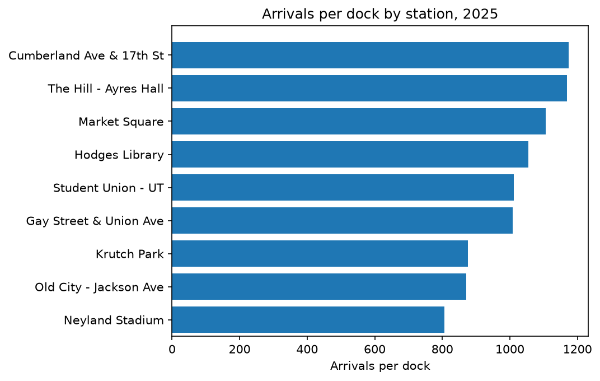
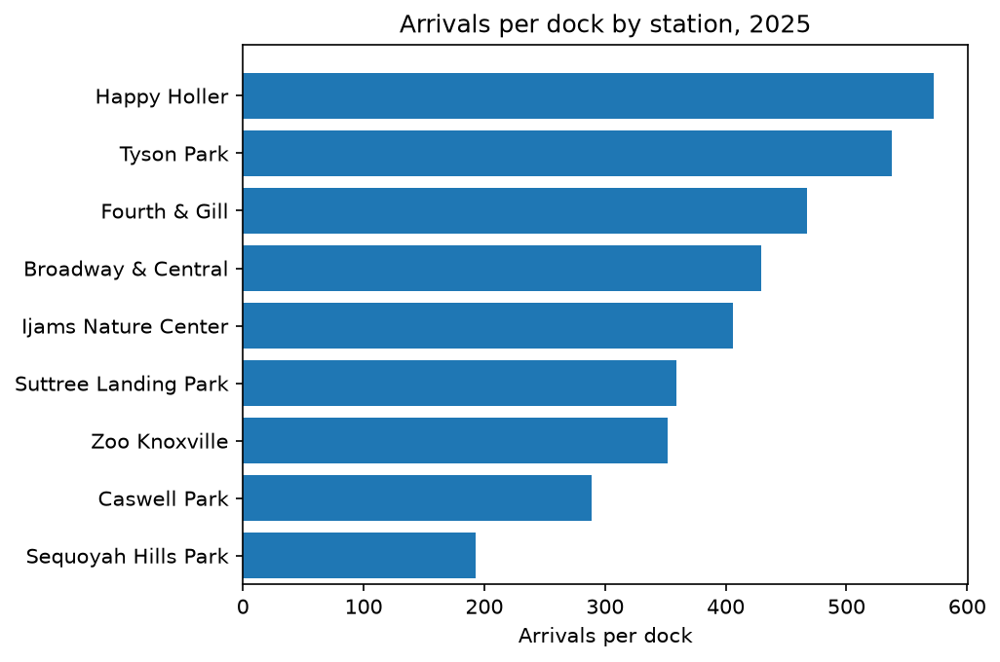

# Ride Knox Ridership Analysis, 2025

## Overview
Which rider group, (`member` vs `casual`) caused the 2025 ridership decline and which stations (`station_name`) are currently strained so we can assess the possibility of expanding them or adding new ones in the `neighborhood`?

## Data (schema table for trips_2025.csv and stations.xlsx) 

**Raw files are **not** in this repo (~22 MB, and the golden rule: never edit raw data)

Request `trips_2025.csv` and `stations.xlsx` from the Ride Knox data team.

`trips_2025.csv` — one row per trip:

| column | type | notes |
| ------------------------------- | -------- | ---------------------------------- |
| trip_id | str | unique, T-series |
| start_time / end_time | datetime | stored as text in the raw file |
| start_station_id | str | joins to stations.station_id |
| start_station_name | str | authoritative names in stations.xlsx |
| end_station_id | str | ~3,800 missing (kept and flagged) |
| rider_type | str | member / casual (raw has 6 spellings) |
| bike_type | str | classic / electric |

`stations.xlsx` — one row per station:

| column | type | notes |
| ------------------------------- | -------- | ---------------------------------- |
| station_id | str | 24 unique stations, joins with trips at trips.start_station_id |
| station_name | str | 24 authoritative names |
| neighborhood | str | Area where the stations are found |
| latitude | float64  | geographical location |
| longitude | float64  | geographical location |
| docks | int64  | Each station has variable number of docks |
| year_installed | int64 | Earliest installation in 2022 |

## How to run
-**Tools:** Python, pandas, matplotlib. 
-**Reproducibility:** Install requirements, open analysis.ipynb, Restart & Run All.

## Key findings
Cumberland Ave & 17th St station in Fort Sanders neighborhood has highest arrivals per dock,
while Sequoyah Hills Park has the lowest number of arrivals per dock.

 & 

## Limitations
A 2 minute trip is not realistic even though used as the cutoff threshold.
Trips over 24 hours were excluded since bikes likely never docked.
One year of data is not enough to make a conclusion, and it's rather observational.

## Repo structure
|---charts/
    |__2025_arrivals_per_dock.png
    |__2026_rider_type_by_day.png
    |__High_pressure_arrivals_per_dock_2026.png
    |__Low_pressure_arrivals_per_dock_2026.png
    |__member_vs_nonmember_monthly_trips.png
    |__monthly_duration_median.png
    |__ridership_trips_by_type.png
|---Notebooks/
    |__analysis.ipynb
|---WORKLOG.md
|---COLLAB-LOG.md
|---memo.md
|---repository_evidence.png
|---Line_comment_PR.png
|---Mention_cross_link.png
|---.gitignore