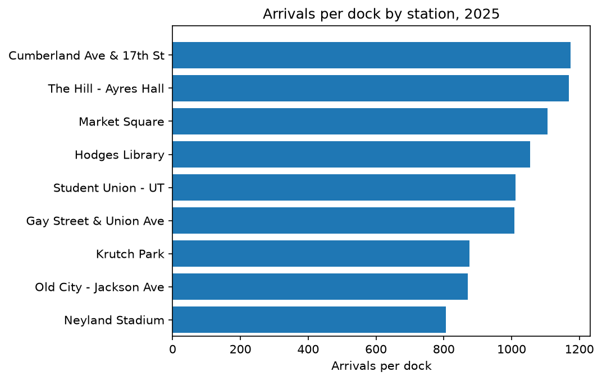
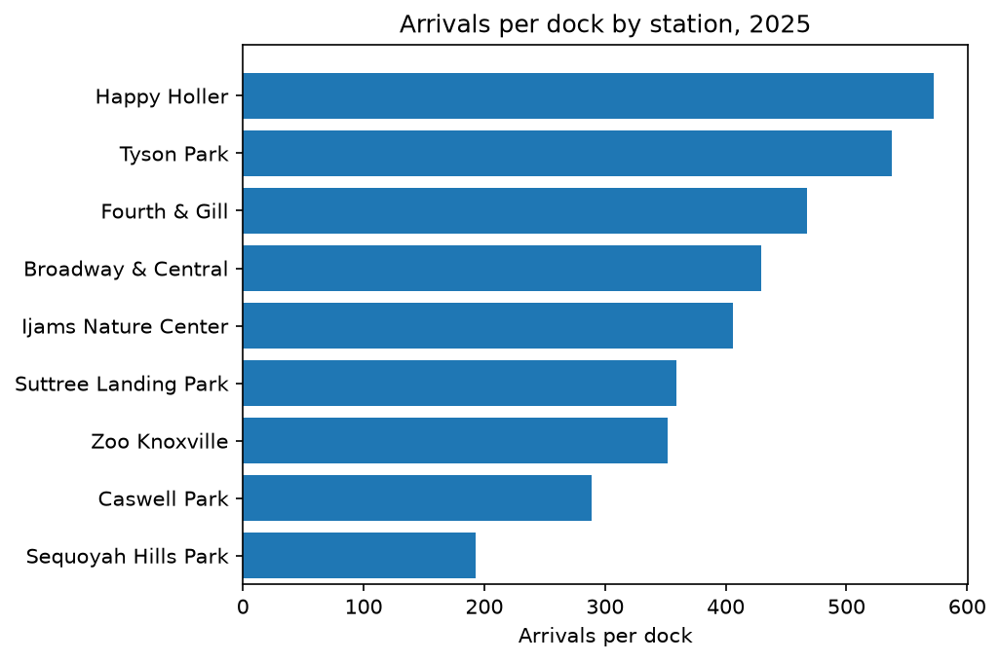

# Ride Knox Ridership Analysis, 2025–2026

**Headline:** The 2026 Day Pass brought non-member ridership most of the way back to
its pre-price-increase level, without pulling members away from their memberships.

## 2026 chapter: did the Day Pass work?

Counting casual riders alone, June 2026 ridership was still down 18% year over year.
Counting casual riders plus the new day-pass riders together, non-member trips passed
the 2025 baseline in May and reached +12% in June. Two of the capacity investments also
worked: pressure at Hodges Library and the Student Union fell 31% after the dock
expansions and the new Cumberland Ave & 22nd St station opened third-busiest system-wide.


See [`2026/memo_2026.md`](2026/memo_2026.md) for the full board memo and
[`2026/analysis_2026.ipynb`](2026/analysis_2026.ipynb) for the notebook.

## 2025 chapter: what caused the decline

The July 2025 casual-ride price increase is what the 2026 chapter measures recovery
against. Casual ridership fell off a cliff after the price increase, while member
ridership followed a normal seasonal curve. Cumberland Ave & 17th St (Fort Sanders) had
the highest arrivals per dock of any station; Sequoyah Hills Park had the lowest.





See [`2025/memo.md`](2025/memo.md) for the full memo and
[`2025/analysis.ipynb`](2025/analysis.ipynb) for the notebook (this notebook also
contains the year-over-year recovery comparison the 2026 chapter above summarizes).

## Limitations

A 2-minute trip is not a realistic minimum, even though it's used as the cleaning
cutoff. Trips over 24 hours were excluded since bikes likely never docked. Six months of
2026 data cannot fully separate the Day Pass effect from the 2025 price shock simply
fading on its own, and without day-pass customer IDs, the recovery figure is an upper
bound on riders, not a count of them.

## Data

Raw files are **not** in this repo (the golden rule: never edit raw data, never commit
it). Request `trips_2025.csv`, `stations.xlsx`, `trips_2026_h1.csv`, and
`stations_2026.xlsx` from the Ride Knox data team.

`trips_2025.csv` / `trips_2026_h1.csv` — one row per trip:

| column | type | notes |
| ------------------------------- | -------- | ---------------------------------- |
| trip_id | str | unique, T-series |
| start_time / end_time | datetime | stored as text in the raw file |
| start_station_id | str | joins to stations.station_id |
| start_station_name | str | authoritative names in stations.xlsx |
| end_station_id | str | ~3,800 missing in 2025 (kept and flagged) |
| rider_type | str | member / casual in 2025; member / casual / day_pass in 2026 |
| bike_type | str | classic / electric |

`stations.xlsx` / `stations_2026.xlsx` — one row per station:

| column | type | notes |
| ------------------------------- | -------- | ---------------------------------- |
| station_id | str | joins with trips at trips.start_station_id |
| station_name | str | authoritative names |
| neighborhood | str | area where the station is found |
| latitude / longitude | float64 | geographical location |
| docks | int64 | each station has a variable number of docks |
| year_installed | int64 | 2025 file starts in 2022; 2026 file adds new 2026 stations |

## How to run

**Tools:** Python, pandas, matplotlib, openpyxl.

**Setup:** `pip install -r requirements.txt`

**2025 analysis:** place `trips_2025.csv`, `stations.xlsx`, `trips_2026_h1.csv`, and
`stations_2026.xlsx` in `2025/`, then open `2025/analysis.ipynb` and Restart & Run All.

**2026 analysis:** place the same four data files in `2026/`, then open
`2026/analysis_2026.ipynb` and Restart & Run All.

Each notebook reads its data files from its own folder, so a copy of the raw files
(never committed) needs to sit next to whichever notebook you're running.

## Repo structure

```
2025/
  analysis.ipynb
  memo.md
  charts/
2026/
  analysis_2026.ipynb
  memo_2026.md
  charts/
index.md
RELEASE-NOTE.md
PROJECT-LOG.md
requirements.txt
_config.yml
.gitignore
```
